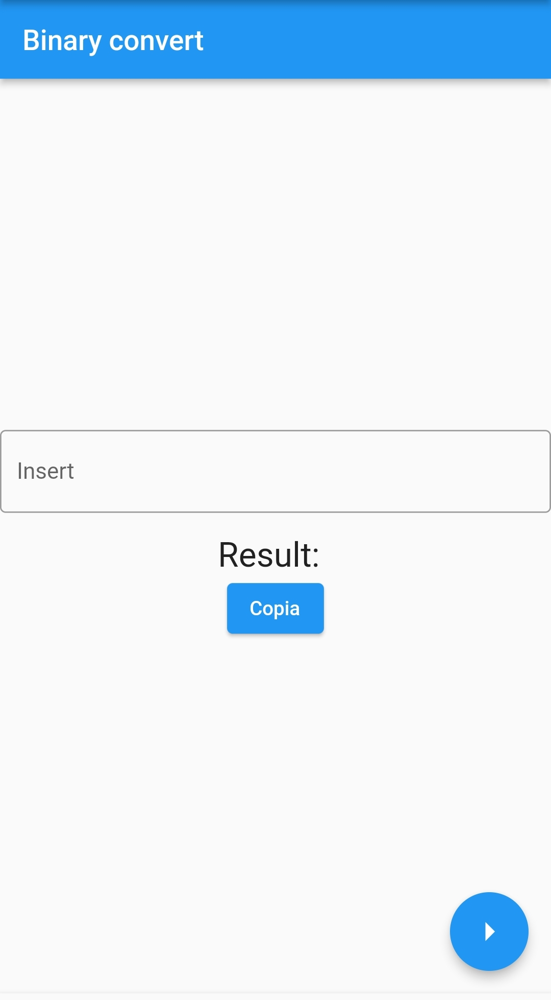
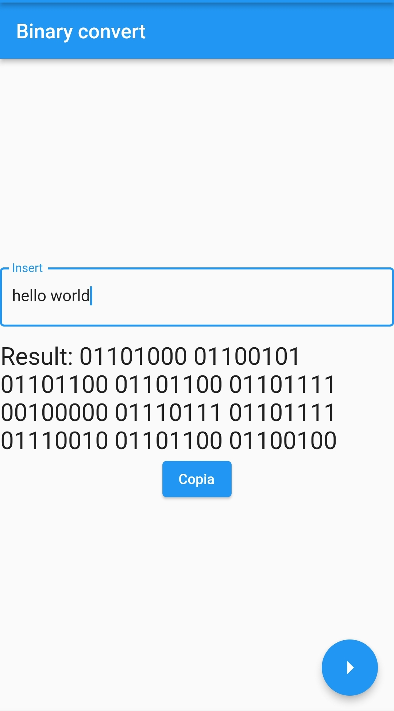

# flutter_converter

Flutter Converter is a user-friendly application available on both Android and iOS devices. Developed with Flutter and Dart, this project seamlessly combines efficiency with an intuitive user interface. Whether you're using an Android smartphone or an iOS device, Flutter Converter offers a simple and smooth experience for all users.

Flutter Converter is designed to take a string of characters as input and provide the corresponding binary language translation as output.

<figure>
  
  <figcaption>
    Example screen
  </figcaption>
</figure>

<figure>
  
</figure>

